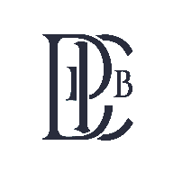

<!-- Improved compatibility of back to top link: See: https://github.com/othneildrew/Best-README-Template/pull/73 -->
<a id="readme-top"></a>

<!-- PROJECT SHIELDS -->
[![Contributors][contributors-shield]][contributors-url]
[![Forks][forks-shield]][forks-url]
[![Stargazers][stars-shield]][stars-url]
[![Issues][issues-shield]][issues-url]
[![AGPLv3 License][license-shield]][license-url]

<!-- PROJECT LOGO -->
<br />
<div align="center">
  <a href="https://github.com/yukazakiri/koakademy">
    
  </a>

  <h3 align="center">KoAkademy</h3>

  <p align="center">
    Academic management platform built on Laravel 12, Filament, Inertia + React, and Tailwind CSS.
    <br />
    <a href="GETTING_STARTED.md"><strong>Explore the docs »</strong></a>
    <br />
    <br />
    <a href="https://portal.koakademy.edu">View Demo</a>
    &middot;
    <a href="https://github.com/yukazakiri/koakademy/issues/new?labels=bug">Report Bug</a>
    &middot;
    <a href="https://github.com/yukazakiri/koakademy/issues/new?labels=enhancement">Request Feature</a>
  </p>
</div>

<!-- TABLE OF CONTENTS -->
<details>
  <summary>Table of Contents</summary>
  <ol>
    <li>
      <a href="#about-the-project">About The Project</a>
      <ul>
        <li><a href="#built-with">Built With</a></li>
      </ul>
    </li>
    <li>
      <a href="#getting-started">Getting Started</a>
      <ul>
        <li><a href="#prerequisites">Prerequisites</a></li>
        <li><a href="#installation">Installation</a></li>
      </ul>
    </li>
    <li><a href="#usage">Usage</a></li>
    <li><a href="#roadmap">Roadmap</a></li>
    <li><a href="#contributing">Contributing</a></li>
    <li><a href="#license">License</a></li>
    <li><a href="#acknowledgments">Acknowledgments</a></li>
  </ol>
</details>

<!-- ABOUT THE PROJECT -->
## About The Project

[![KoAkademy][product-screenshot]](https://portal.koakademy.edu)

KoAkademy is a Laravel-based academic platform for student lifecycle workflows (enrollment, billing/tuition, schedules, and administrative operations).
It uses Inertia + React for the UI and Filament for admin tooling, with settings-driven branding (logo/favicon/Open Graph) and PWA support.

Here's why:
* Academic workflows shouldn’t sprawl across multiple tools.
* Branding and metadata should be configurable without code changes.
* Local development should be predictable and containerized.

<p align="right">(<a href="#readme-top">back to top</a>)</p>

### Built With

* [![Laravel][Laravel.com]][Laravel-url]
* [![Inertia][Inertia.shield]][Inertia-url]
* [![React][React.js]][React-url]
* [![Tailwind CSS][Tailwind.shield]][Tailwind-url]
* [![PostgreSQL][Postgres.shield]][Postgres-url]
* [![Vite][Vite.shield]][Vite-url]

<p align="right">(<a href="#readme-top">back to top</a>)</p>

<!-- GETTING STARTED -->
## Getting Started

To get a local copy up and running, follow these steps.

### Prerequisites

* Docker + Docker Compose
* Composer (for the first install)

### Installation

1. Clone the repo
   ```sh
   git clone https://github.com/yukazakiri/koakademy.git
   cd koakademy
   ```

2. Install dependencies and bootstrap environment
   ```sh
   cp .env.example .env
   composer install
   vendor/bin/sail up -d
   vendor/bin/sail artisan key:generate
   vendor/bin/sail artisan migrate
   vendor/bin/sail npm install
   ```

3. Start the frontend dev server
   ```sh
   vendor/bin/sail npm run dev
   ```

<p align="right">(<a href="#readme-top">back to top</a>)</p>

<!-- USAGE EXAMPLES -->
## Usage

Local hosts:

* `https://portal.koakademy.test`
* `https://admin.koakademy.test`

Common commands:

```sh
vendor/bin/sail up -d
vendor/bin/sail stop

vendor/bin/sail artisan migrate
vendor/bin/sail artisan test --compact
vendor/bin/sail bin pint --dirty --format agent

vendor/bin/sail npm run dev
vendor/bin/sail npm run build
```

Docs:

* [Getting Started](GETTING_STARTED.md)
* [Development Guide](DEVELOPMENT.md)
* [Deployment Guide](DEPLOYMENT.md)
* [Dev Container Setup](DEVCONTAINER_SETUP.md)

<p align="right">(<a href="#readme-top">back to top</a>)</p>

<!-- ROADMAP -->
## Roadmap

- [ ] Continue migration of legacy hardcoded brand/domain strings to settings-driven values
- [ ] Expand API docs coverage for enrollment and finance endpoints
- [ ] Improve release automation and deployment validation checks

See the [open issues][issues-url] for a full list of proposed features (and known issues).

<p align="right">(<a href="#readme-top">back to top</a>)</p>

<!-- CONTRIBUTING -->
## Contributing

Contributions are welcome.

1. Fork the Project
2. Create your Feature Branch (`git checkout -b feature/AmazingFeature`)
3. Commit your Changes (`git commit -m 'feat: add amazing feature'`)
4. Push to the Branch (`git push origin feature/AmazingFeature`)
5. Open a Pull Request

Before opening a PR, please run:

```sh
vendor/bin/sail bin pint --dirty --format agent
vendor/bin/sail artisan test --compact
```

<p align="right">(<a href="#readme-top">back to top</a>)</p>

<!-- LICENSE -->
## License

Distributed under the GNU Affero General Public License v3.0 or later. See [`LICENSE.md`](LICENSE.md) for more information.

<p align="right">(<a href="#readme-top">back to top</a>)</p>

<!-- ACKNOWLEDGMENTS -->
## Acknowledgments

* [Laravel](https://laravel.com)
* [Filament](https://filamentphp.com)
* [Inertia.js](https://inertiajs.com)
* [React](https://react.dev)
* [Tailwind CSS](https://tailwindcss.com)
* [Shields.io](https://shields.io)

<p align="right">(<a href="#readme-top">back to top</a>)</p>

<!-- MARKDOWN LINKS & IMAGES -->
<!-- https://www.markdownguide.org/basic-syntax/#reference-style-links -->
[contributors-shield]: https://img.shields.io/github/contributors/yukazakiri/koakademy.svg?style=for-the-badge
[contributors-url]: https://github.com/yukazakiri/koakademy/graphs/contributors
[forks-shield]: https://img.shields.io/github/forks/yukazakiri/koakademy.svg?style=for-the-badge
[forks-url]: https://github.com/yukazakiri/koakademy/network/members
[stars-shield]: https://img.shields.io/github/stars/yukazakiri/koakademy.svg?style=for-the-badge
[stars-url]: https://github.com/yukazakiri/koakademy/stargazers
[issues-shield]: https://img.shields.io/github/issues/yukazakiri/koakademy.svg?style=for-the-badge
[issues-url]: https://github.com/yukazakiri/koakademy/issues
[license-shield]: https://img.shields.io/github/license/yukazakiri/koakademy.svg?style=for-the-badge
[license-url]: https://github.com/yukazakiri/koakademy/blob/master/LICENSE.md

[product-screenshot]: public/web-app-manifest-192x192.png

[Laravel.com]: https://img.shields.io/badge/Laravel-FF2D20?style=for-the-badge&logo=laravel&logoColor=white
[Laravel-url]: https://laravel.com
[Inertia.shield]: https://img.shields.io/badge/Inertia-9553E9?style=for-the-badge&logo=inertia&logoColor=white
[Inertia-url]: https://inertiajs.com
[React.js]: https://img.shields.io/badge/React-20232A?style=for-the-badge&logo=react&logoColor=61DAFB
[React-url]: https://react.dev
[Tailwind.shield]: https://img.shields.io/badge/Tailwind_CSS-38BDF8?style=for-the-badge&logo=tailwindcss&logoColor=white
[Tailwind-url]: https://tailwindcss.com
[Postgres.shield]: https://img.shields.io/badge/PostgreSQL-316192?style=for-the-badge&logo=postgresql&logoColor=white
[Postgres-url]: https://www.postgresql.org
[Vite.shield]: https://img.shields.io/badge/Vite-646CFF?style=for-the-badge&logo=vite&logoColor=white
[Vite-url]: https://vitejs.dev
