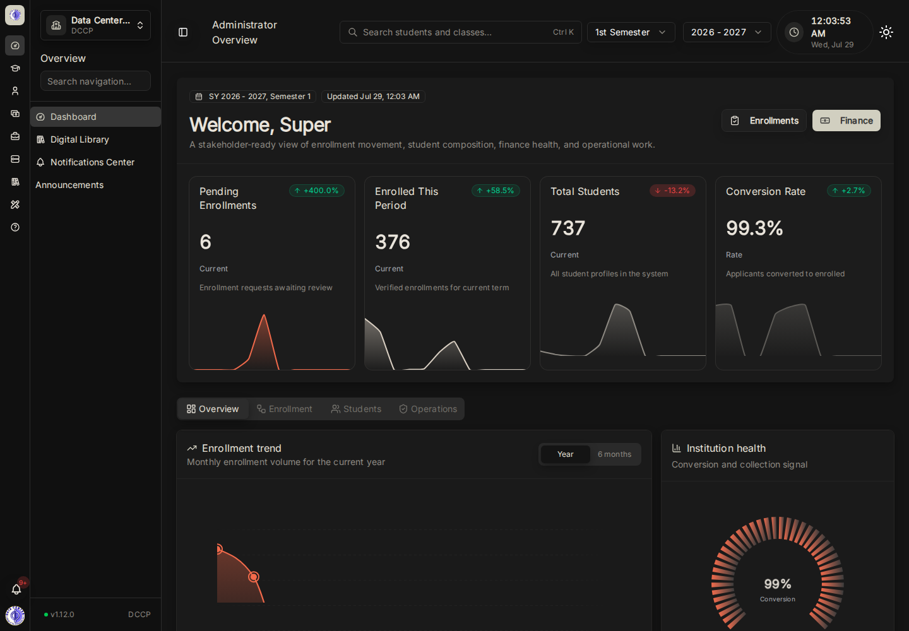
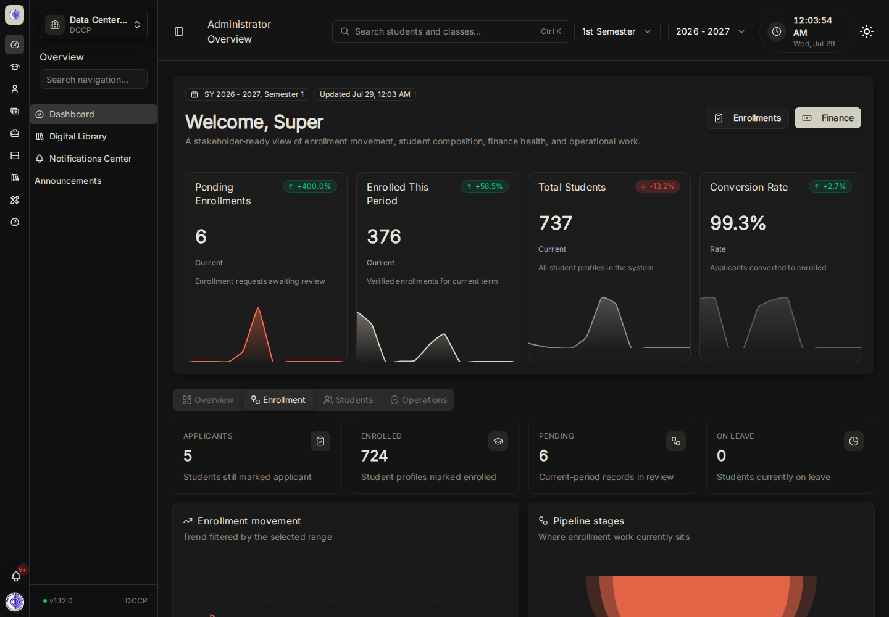
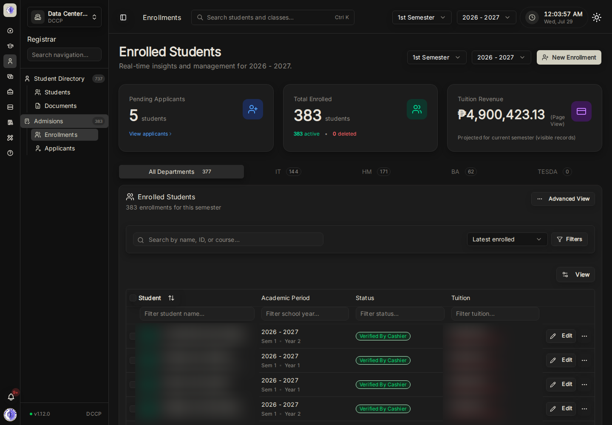
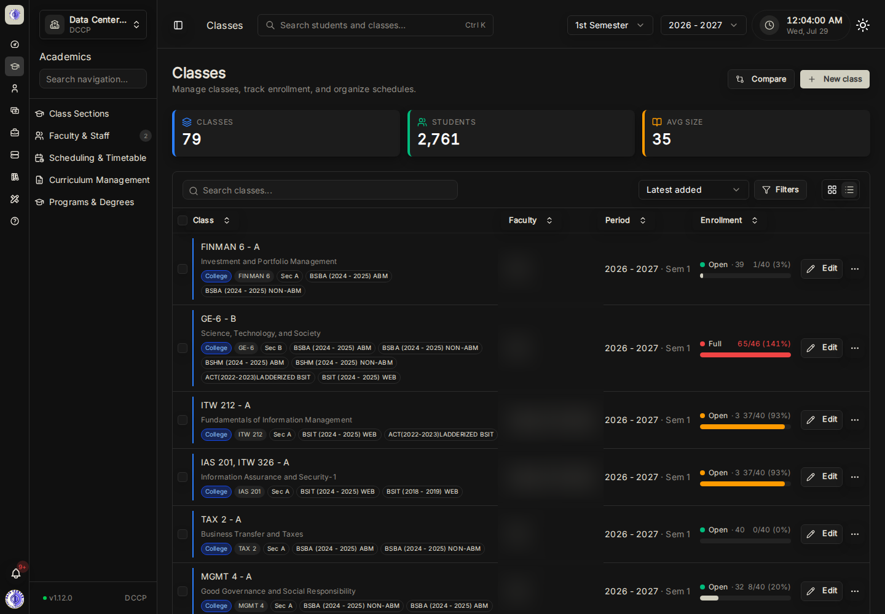
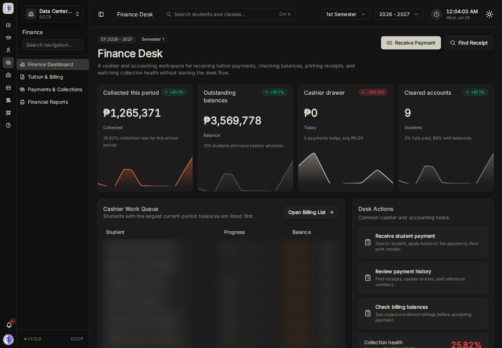
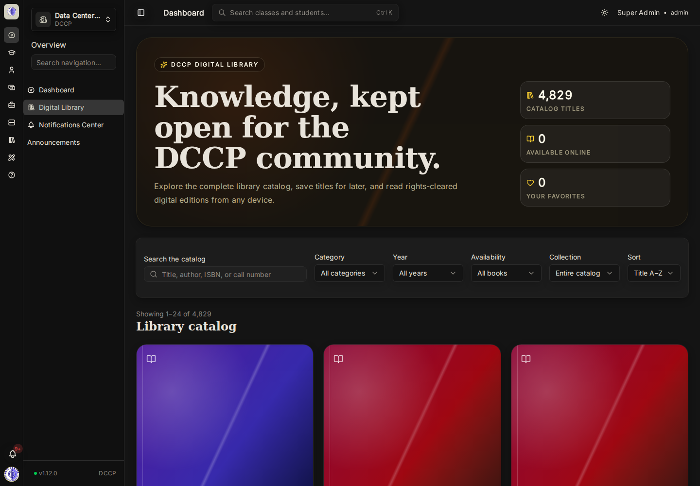
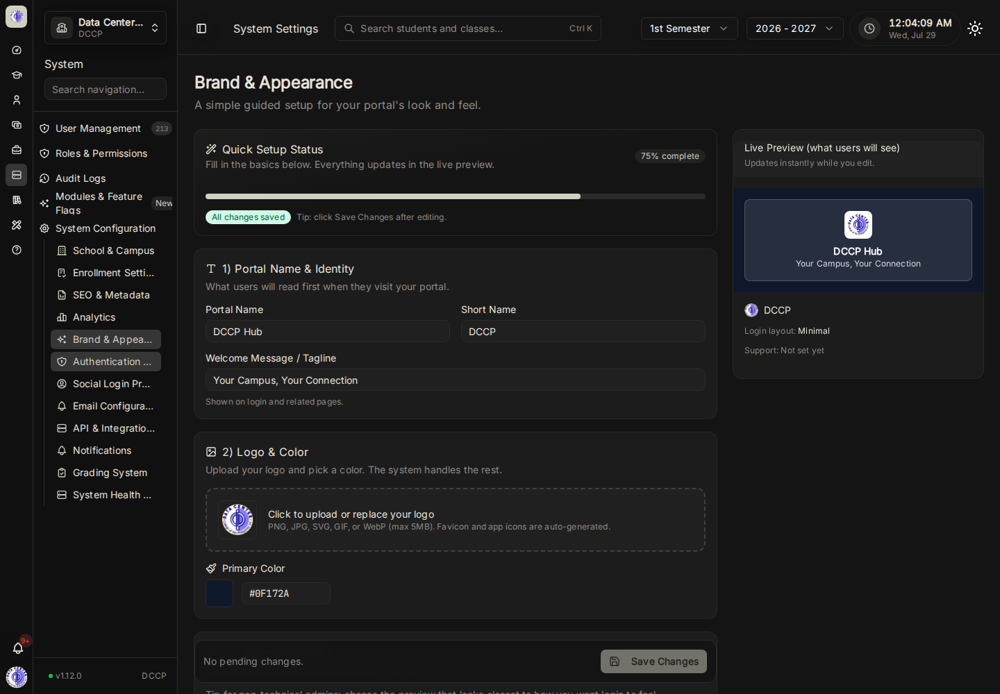

# KoAkademy

<p align="center">
  <em>Your school, your server, your rules.</em>
</p>

The only school management platform that doesn't treat your students like a monetization opportunity. Enrollment, records, classes, schedules, grading, finance, and a whole suite of optional modules — all in one app, running quietly on a machine you actually own.

Under the hood it's **Laravel 12**, **Filament 5**, **Inertia**, and **React 19**, bundled into a single FrankenPHP container. Drop it on a VPS, an old office server, or a Raspberry Pi that's been collecting dust — as long as it runs Docker, KoAkademy runs on it.

> [!WARNING]
> KoAkademy is currently in **Beta** and is **not recommended for production use**. Data loss, breaking changes, and incompatible upgrades are possible between pre-v2 releases. A stable, production-recommended release stream is planned starting at **v2.0.0**.

[](https://github.com/yukazakiri/koakademy/actions/workflows/ci.yml)
[](https://github.com/yukazakiri/koakademy/releases)
[](LICENSE.md)
[](https://www.php.net/)
[](https://laravel.com/)
[](https://filamentphp.com/)
[](https://react.dev/)
[](https://frankenphp.com/)
[](https://hub.docker.com/r/yukazakiri/koakademy)
[](https://github.com/yukazakiri/koakademy/stars)
[](https://github.com/yukazakiri/koakademy)

> **Production-capable beta.** KoAkademy has a documented production topology and automated tests, but you should validate upgrades in staging, keep backups, and review the security model for your institution. Only the latest stable release is supported.

---

## The pitch

Here's a fun thought experiment: right now, somewhere out there, is a cloud-hosted LMS holding thousands of student names, home addresses, medical records, and financial data. It's secured by whatever SOC 2 report the vendor's sales team waved around last quarter, maintained by an ops team you'll never meet, and governed by a privacy policy that's three clicks deep on a landing page nobody reads. One breach, one insolvency, one "strategic pivot" — and years of institutional records vanish, or worse, leak.

That's not a dystopian hypothetical. That's literally how most schools operate today.

KoAkademy is the "no thanks" button. It's a fully open-source, self-hosted school platform that puts every byte of student data on hardware you control. Not a neutered freemium tier. Not a "cloud-native" platform that gates exports behind a renewal invoice. An actual, feature-complete system — your PostgreSQL, your backups, your retention schedule, your conscience.

---

## What you get

The whole package, no per-seat pricing and no feature flags behind a sales call:

- **Guided setup** — a `/setup` wizard spins up your institution and first admin in minutes. No CLI archaeology required.
- **Full academic admin** — students, faculty, courses, classes, rooms, timetables with conflict detection, enrollment pipelines, and grading (point/percent, GWA rules) through a clean Filament admin panel. No "upgrade to add more than 50 students" nonsense.
- **Enrollment engine** — a registrar-to-cashier verification flow layered on top of versioned **blueprints**: scoped, inheritable policies with simulation, staged rollout, and instant rollback. Enrollment should feel like a workflow, not a CSV-email apocalypse.
- **Three React portals** — one for admins, one for faculty (attendance, class posts, submissions, grading), one for students (classes, schedule, tuition, digital ID). No forcing everyone onto the same dashboard or a random mobile app nobody asked for.
- **Finance** — tuition assessment, cashier workflows, payment posting, statements of account with cryptographically-signed public verification, and finance reports. Your money data stays in your database, not some SaaS vendor's analytics pipeline.
- **Security that means something** — 30 role-based access levels via Filament Shield, TOTP + email-code MFA, WebAuthn passkeys, safe impersonation with full audit trails. No "trust us" marketing fluff needed.
- **Optional modules** — Inventory, Library, Cashier, Student Medical Records, Announcements, template-driven Notification Center. Toggle them per institution. No "contact enterprise sales" gatekeeping.
- **Platform extras** — Gotenberg-powered PDF generation (statements, timetables, assessments), Excel exports, school-scoped multi-tenancy, 36 runtime feature flags (Laravel Pennant), PWA manifest, broadcasting, and a documented Sanctum API.

> The API surface is beta. Only endpoints in the [API docs](docs/src/content/docs/api/api-overview.mdx) are part of the public contract.

## Screenshots

### Administrator experience

<p align="center">
  
</p>

<p align="center"><em>Administrator overview with unified navigation, live enrollment monitoring, finance shortcuts, and institutional health reporting.</em></p>

<p align="center">
  
</p>

<p align="center"><em>Enrollment analytics workspace with applicant status, pipeline visibility, and movement reporting.</em></p>

### Enrollment and registrar workflow

<p align="center">
  
</p>

<p align="center"><em>Real-time enrollment management with applicants, department filters, verification status, tuition visibility, and quick actions. Student identities and individual balances are blurred.</em></p>

### Academics and scheduling

<p align="center">
  
</p>

<p align="center"><em>Class sections, capacity tracking, program coverage, comparison tools, and schedule-aware academic management. Faculty identities are blurred.</em></p>

### Finance operations

<p align="center">
  
</p>

<p align="center"><em>A cashier-focused workspace for collection health, outstanding balances, receipts, billing, and payment workflows. Student-level queue details are blurred.</em></p>

### Digital library

<p align="center">
  
</p>

<p align="center"><em>A searchable library catalog with category, year, availability, and collection filters plus rights-cleared digital editions.</em></p>

### White-label branding

<p align="center">
  
</p>

<p align="center"><em>Guided portal branding with identity, logo, color controls, and an instant live preview.</em></p>

### Enrollment policy configuration

<p align="center">
  
  
</p>

## Quick start

Docker is the only real requirement. Linux box, Windows with Docker Desktop — whatever you've got. No demo call, no "our team will reach out in 48 hours," no credit card form.

**Linux:**

```sh
bash -c "$(curl -fsSL https://raw.githubusercontent.com/yukazakiri/koakademy/master/scripts/install.sh)"
```

**Windows (PowerShell):**

```powershell
& ([scriptblock]::Create((irm https://raw.githubusercontent.com/yukazakiri/koakademy/master/scripts/install.ps1)))
```

One command. It initializes a Docker Swarm, spins up PostgreSQL, Redis, Gotenberg, and S3-compatible storage, generates secrets, runs migrations, and verifies `/up` before handing you the `/setup` URL. Your data, your server, zero middlemen.

Poke it to make sure it's awake:

```sh
curl --fail http://127.0.0.1:8000/up
```

Stable multi-arch images live at `ghcr.io/yukazakiri/koakademy:vX.Y.Z` and `yukazakiri/koakademy:vX.Y.Z`. Pin an exact tag for production. `latest` tracks the newest stable release; `edge` is a rolling preview — fun to kick the tires, not something to bet a semester on.

> The one-liner fetches and runs a remote script with elevated privileges. Worth a peek first:
> ```sh
> curl -fsSLO https://raw.githubusercontent.com/yukazakiri/koakademy/master/scripts/install.sh
> less install.sh
> bash install.sh
> ```

## How it runs

The default installer puts everything in a Docker Swarm. The app listens on port `8000`. PostgreSQL, Redis, and Gotenberg hang out on a private overlay network. Local RustFS exposes its S3 API on port `9000` while keeping its console locked down. If you'd rather use plain Compose, `compose.production.yaml` binds the app to `127.0.0.1:8000` instead.

Slap an HTTPS edge in front of port `8000` — Caddy, Nginx, Traefik, a Cloudflare tunnel, whatever you're comfortable with. HTTPS isn't a nice-to-have when you're handling student data.

## Docs

Hit the [docs site](https://yukazakiri.github.io/koakademy/) for the full deep dive, or grab what you need from the repo:

**Running KoAkademy:**
- [Getting Started](GETTING_STARTED.md) — installation, prereqs, the one-liner
- [Deployment](DEPLOYMENT.md) — upgrades, backups, rollback, production checklist
- [Configuration](CONFIGURATION.md) — env vars and service contracts
- [Troubleshooting](TROUBLESHOOTING.md) — when something's not right
- [FAQ](FAQ.md) — you know the drill

**Building or contributing:**
- [Development](DEVELOPMENT.md) — native setup, testing, conventions
- [Contributing](CONTRIBUTING.md) — PR checklist, docs ownership
- [Architecture](ARCHITECTURE.md) — runtime, layers, tenancy, queues
- [Security](SECURITY.md) — reporting vulns, operational baseline

The docs site also covers system internals, enrollment blueprints, the API reference, and staff-facing user guides.

## Contributing + security

Bug reports and pull requests are more than welcome — jump in via [Contributing](CONTRIBUTING.md). Found something scary? Don't drop it in a public issue. Use [Security](SECURITY.md) and GitHub Security Advisories.

## License

KoAkademy is [GNU AGPL-3.0-or-later](LICENSE.md). If your users interact with a modified version over a network, they're entitled to the source. Unlike a certain category of LMS vendors we could name, the code that handles your students' data is right here for anyone to read, audit, and improve.
