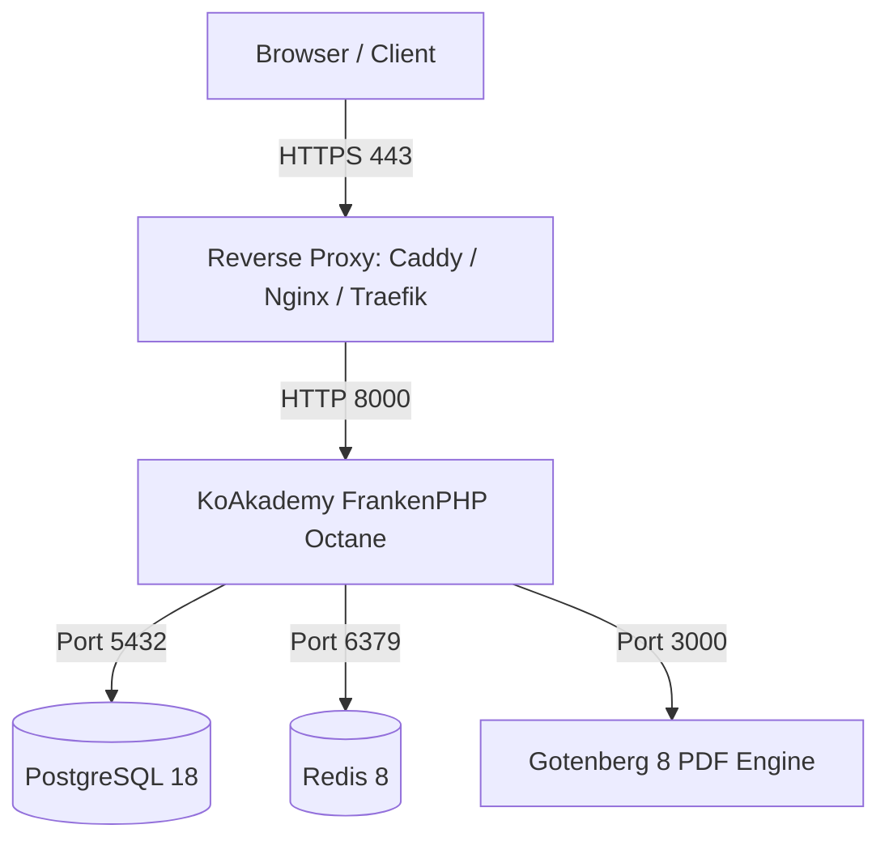

Docker Compose is the recommended deployment method for operators who manage their own reverse proxy, firewall, or existing Docker host infrastructure.

## Architecture Overview

A standard production Compose deployment consists of four containers communicating over an internal Docker bridge network:



- **Application (`app`)**: Runs PHP 8.5 on FrankenPHP (Laravel Octane), Supercronic (cron scheduler), and Supervisor worker processes on port `8000`.
- **PostgreSQL (`postgres`)**: Relational database storage (PostgreSQL 18).
- **Redis (`redis`)**: Cache, sessions, queue backplane, and real-time locking.
- **Gotenberg (`gotenberg`)**: Headless Chromium and LibreOffice microservice on port `3000` for PDF generation (transcripts, certificates, and invoices).

---

## Prerequisites

- Linux server (Ubuntu 22.04/24.04 LTS, Debian 12, Rocky Linux 9, or AlmaLinux 9).
- Docker Engine 24+ and Docker Compose v2.20+.
- Domain name pointing (A/AAAA records) to your server's public IP address.
- At least 4 GB RAM and 2 vCPUs recommended for production workloads.

---

## Step 1: Create Project Directory

Create a dedicated directory on your server:

```sh
sudo mkdir -p /opt/koakademy
sudo chown -R $USER:$USER /opt/koakademy
cd /opt/koakademy
```

---

## Step 2: Configure Environment Variables

Create `.env` based on the production template:

```sh
cat << 'EOF' > .env
# Application Settings
APP_NAME=KoAkademy
APP_ENV=production
APP_DEBUG=false
APP_URL=https://school.example.com
APP_KEY=

# Server & Runtime
APP_PORT=8000
OCTANE_SERVER=frankenphp
AUTO_MIGRATE=true
RUN_OPTIMIZE=foreground

# Database (PostgreSQL)
DB_CONNECTION=pgsql
DB_HOST=postgres
DB_PORT=5432
DB_DATABASE=koakademy
DB_USERNAME=koakademy
DB_PASSWORD=change_this_to_a_strong_database_password

# Cache, Sessions & Queues (Redis)
CACHE_STORE=redis
SESSION_DRIVER=redis
QUEUE_CONNECTION=redis
REDIS_HOST=redis
REDIS_PORT=6379
REDIS_PASSWORD=change_this_to_a_strong_redis_password

# PDF Generation Engine
GOTENBERG_URL=http://gotenberg:3000

# Filesystem & Storage (local default, recommend S3/R2 for multi-node)
FILESYSTEM_DISK=public

# Mail Configuration (Example: SMTP)
MAIL_MAILER=smtp
MAIL_HOST=smtp.mailgun.org
MAIL_PORT=587
MAIL_USERNAME=postmaster@school.example.com
MAIL_PASSWORD=your_smtp_password
MAIL_ENCRYPTION=tls
MAIL_FROM_ADDRESS=notifications@school.example.com
MAIL_FROM_NAME="KoAkademy Notification"
EOF
```

Generate a secure application key:

```sh
docker run --rm ghcr.io/yukazakiri/koakademy:latest php artisan key:generate --show
```

Copy the generated `base64:...` key and set it as `APP_KEY` in your `.env` file.

---

## Step 3: Production `compose.yaml`

Create your `compose.yaml` file:

```yaml
name: koakademy

services:
  app:
    image: ghcr.io/yukazakiri/koakademy:latest
    restart: unless-stopped
    env_file:
      - .env
    ports:
      - "127.0.0.1:${APP_PORT:-8000}:8000"
    volumes:
      - app-storage:/app/storage
    depends_on:
      postgres:
        condition: service_healthy
      redis:
        condition: service_healthy
      gotenberg:
        condition: service_healthy
    healthcheck:
      test: ["CMD", "healthcheck"]
      interval: 30s
      timeout: 10s
      retries: 5
      start_period: 45s

  postgres:
    image: postgres:18-alpine
    restart: unless-stopped
    environment:
      POSTGRES_DB: ${DB_DATABASE:-koakademy}
      POSTGRES_USER: ${DB_USERNAME:-koakademy}
      POSTGRES_PASSWORD: ${DB_PASSWORD:?Set DB_PASSWORD in .env}
    volumes:
      - postgres-data:/var/lib/postgresql/data
    healthcheck:
      test: ["CMD-SHELL", "pg_isready -U $$POSTGRES_USER -d $$POSTGRES_DB"]
      interval: 10s
      timeout: 5s
      retries: 5

  redis:
    image: redis:8-alpine
    restart: unless-stopped
    command: ["redis-server", "--appendonly", "yes", "--requirepass", "${REDIS_PASSWORD:?Set REDIS_PASSWORD in .env}"]
    environment:
      REDIS_PASSWORD: ${REDIS_PASSWORD:?Set REDIS_PASSWORD in .env}
    volumes:
      - redis-data:/data
    healthcheck:
      test: ["CMD-SHELL", "redis-cli -a \"$$REDIS_PASSWORD\" ping | grep PONG"]
      interval: 10s
      timeout: 5s
      retries: 5

  gotenberg:
    image: gotenberg/gotenberg:8
    restart: unless-stopped
    healthcheck:
      test: ["CMD", "curl", "--fail", "--silent", "http://localhost:3000/health"]
      interval: 15s
      timeout: 5s
      retries: 5

volumes:
  app-storage:
  postgres-data:
  redis-data:
```

---

## Step 4: Reverse Proxy Configuration

The application container binds to `127.0.0.1:8000`. You need a reverse proxy to terminate TLS/SSL.

### Option A: Caddy (Recommended)

Caddy handles automatic HTTPS via Let's Encrypt:

```caddy
# /etc/caddy/Caddyfile
school.example.com {
    reverse_proxy 127.0.0.1:8000 {
        header_up Host {host}
        header_up X-Real-IP {remote_host}
        header_up X-Forwarded-For {remote_host}
        header_up X-Forwarded-Proto {scheme}
    }
}
```

Reload Caddy:

```sh
sudo systemctl reload caddy
```

### Option B: Nginx

```nginx
# /etc/nginx/sites-available/koakademy.conf
server {
    listen 80;
    server_name school.example.com;
    return 301 https://$host$request_uri;
}

server {
    listen 443 ssl http2;
    server_name school.example.com;

    ssl_certificate /etc/letsencrypt/live/school.example.com/fullchain.pem;
    ssl_certificate_key /etc/letsencrypt/live/school.example.com/privkey.pem;

    client_max_body_size 100M;

    location / {
        proxy_pass http://127.0.0.1:8000;
        proxy_http_version 1.1;
        proxy_set_header Upgrade $http_upgrade;
        proxy_set_header Connection "upgrade";
        proxy_set_header Host $host;
        proxy_set_header X-Real-IP $remote_addr;
        proxy_set_header X-Forwarded-For $proxy_add_x_forwarded_for;
        proxy_set_header X-Forwarded-Proto $scheme;
        proxy_set_header X-Forwarded-Host $host;
        proxy_set_header X-Forwarded-Port $server_port;

        # Disable proxy buffering for streaming/Octane
        proxy_buffering off;
        proxy_read_timeout 300s;
    }
}
```

---

## Step 5: Start Services and Initialize

Start the stack in detached mode:

```sh
docker compose up -d
```

Monitor container startup and logs:

```sh
docker compose logs -f app
```

Once healthy, visit `https://school.example.com/setup` to complete the initial setup wizard and register the primary administrator.

---

## Maintenance & Operations

### Run Database Migrations Manually

```sh
docker compose exec app php artisan migrate --force
```

### Clear Application Cache

```sh
docker compose exec app php artisan optimize:clear
docker compose exec app php artisan optimize
```

### Upgrading to a New Version

```sh
# Pull latest images
docker compose pull

# Restart services with zero-downtime rolling restart
docker compose up -d --remove-orphans

# Verify health status
docker compose ps
```

### Database Backup

```sh
docker compose exec postgres pg_dump -U koakademy -d koakademy -F c > /opt/koakademy/backup_$(date +%Y%m%d_%H%M%S).dump
```
