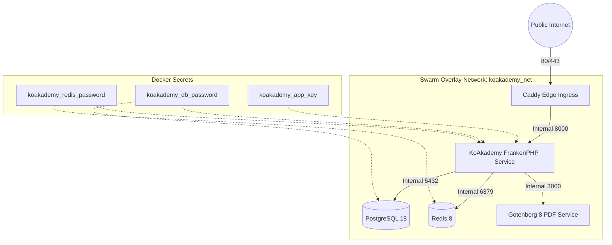

Docker Swarm provides native container orchestration with declarative rolling updates, integrated secrets management, and zero-downtime service rollouts without the overhead of Kubernetes.

This topology powers KoAkademy's official one-line Linux installer.

---

## Swarm Topology Overview



---

## Prerequisites

- Linux host running Docker Engine 24+.
- Initialized Docker Swarm cluster (single-node manager or multi-node cluster):
  ```sh
  docker swarm init
  ```
- Public domain pointing to the manager node IP.

---

## Step 1: Create Overlay Network and Secrets

Create an attachable overlay network for the services:

```sh
docker network create --driver overlay --attachable koakademy_overlay
```

Create secure Docker Secrets for sensitive credentials:

```sh
# Generate App Key
APP_KEY=$(docker run --rm ghcr.io/yukazakiri/koakademy:latest php artisan key:generate --show)
echo "$APP_KEY" | docker secret create koakademy_app_key -

# Database and Redis Passwords
openssl rand -base64 32 | docker secret create koakademy_db_password -
openssl rand -base64 32 | docker secret create koakademy_redis_password -
```

---

## Step 2: Define `stack.yaml`

Create `/opt/koakademy/stack.yaml`:

```yaml
version: "3.8"

services:
  caddy:
    image: caddy:2-alpine
    ports:
      - target: 80
        published: 80
        mode: host
      - target: 443
        published: 443
        mode: host
    volumes:
      - caddy_data:/data
      - caddy_config:/config
      - /opt/koakademy/Caddyfile:/etc/caddy/Caddyfile:ro
    networks:
      - koakademy_overlay
    deploy:
      replicas: 1
      placement:
        constraints:
          - node.role == manager
      restart_policy:
        condition: on-failure

  app:
    image: ghcr.io/yukazakiri/koakademy:latest
    environment:
      APP_NAME: "KoAkademy"
      APP_ENV: "production"
      APP_DEBUG: "false"
      APP_URL: "https://school.example.com"
      OCTANE_SERVER: "frankenphp"
      AUTO_MIGRATE: "true"
      RUN_OPTIMIZE: "foreground"
      
      # Database Connection
      DB_CONNECTION: "pgsql"
      DB_HOST: "postgres"
      DB_PORT: 5432
      DB_DATABASE: "koakademy"
      DB_USERNAME: "koakademy"
      DB_PASSWORD_FILE: "/run/secrets/koakademy_db_password"
      
      # Redis Connection
      CACHE_STORE: "redis"
      SESSION_DRIVER: "redis"
      QUEUE_CONNECTION: "redis"
      REDIS_HOST: "redis"
      REDIS_PORT: 6379
      REDIS_PASSWORD_FILE: "/run/secrets/koakademy_redis_password"
      
      # PDF Engine
      GOTENBERG_URL: "http://gotenberg:3000"
      FILESYSTEM_DISK: "public"
    secrets:
      - koakademy_app_key
      - koakademy_db_password
      - koakademy_redis_password
    volumes:
      - app_storage:/app/storage
    networks:
      - koakademy_overlay
    deploy:
      replicas: 2
      update_config:
        parallelism: 1
        delay: 15s
        order: start-first
        failure_action: rollback
      rollback_config:
        parallelism: 1
        order: start-first
      restart_policy:
        condition: on-failure

  postgres:
    image: postgres:18-alpine
    environment:
      POSTGRES_DB: "koakademy"
      POSTGRES_USER: "koakademy"
      POSTGRES_PASSWORD_FILE: "/run/secrets/koakademy_db_password"
    secrets:
      - koakademy_db_password
    volumes:
      - postgres_data:/var/lib/postgresql/data
    networks:
      - koakademy_overlay
    deploy:
      replicas: 1
      placement:
        constraints:
          - node.role == manager
      restart_policy:
        condition: on-failure

  redis:
    image: redis:8-alpine
    command: ["sh", "-c", "redis-server --appendonly yes --requirepass $(cat /run/secrets/koakademy_redis_password)"]
    secrets:
      - koakademy_redis_password
    volumes:
      - redis_data:/data
    networks:
      - koakademy_overlay
    deploy:
      replicas: 1
      restart_policy:
        condition: on-failure

  gotenberg:
    image: gotenberg/gotenberg:8
    networks:
      - koakademy_overlay
    deploy:
      replicas: 1
      restart_policy:
        condition: on-failure

secrets:
  koakademy_app_key:
    external: true
  koakademy_db_password:
    external: true
  koakademy_redis_password:
    external: true

volumes:
  caddy_data:
  caddy_config:
  app_storage:
  postgres_data:
  redis_data:

networks:
  koakademy_overlay:
    external: true
```

---

## Step 3: Configure Caddyfile

Create `/opt/koakademy/Caddyfile`:

```caddy
school.example.com {
    reverse_proxy app:8000 {
        header_up Host {host}
        header_up X-Real-IP {remote_host}
        header_up X-Forwarded-For {remote_host}
        header_up X-Forwarded-Proto {scheme}
    }
}
```

---

## Step 4: Deploy Stack

Deploy the stack to the Swarm:

```sh
docker stack deploy -c /opt/koakademy/stack.yaml koakademy
```

Check the status of running tasks:

```sh
docker stack ps koakademy
docker service logs -f koakademy_app
```

---

## Zero-Downtime Rolling Upgrades

To update KoAkademy to a new release:

```sh
docker service update \
  --image ghcr.io/yukazakiri/koakademy:v1.2.0 \
  --update-order start-first \
  koakademy_app
```

Swarm will launch new tasks, wait for health check verification at `/up`, and cleanly drain connections from older containers before stopping them.
